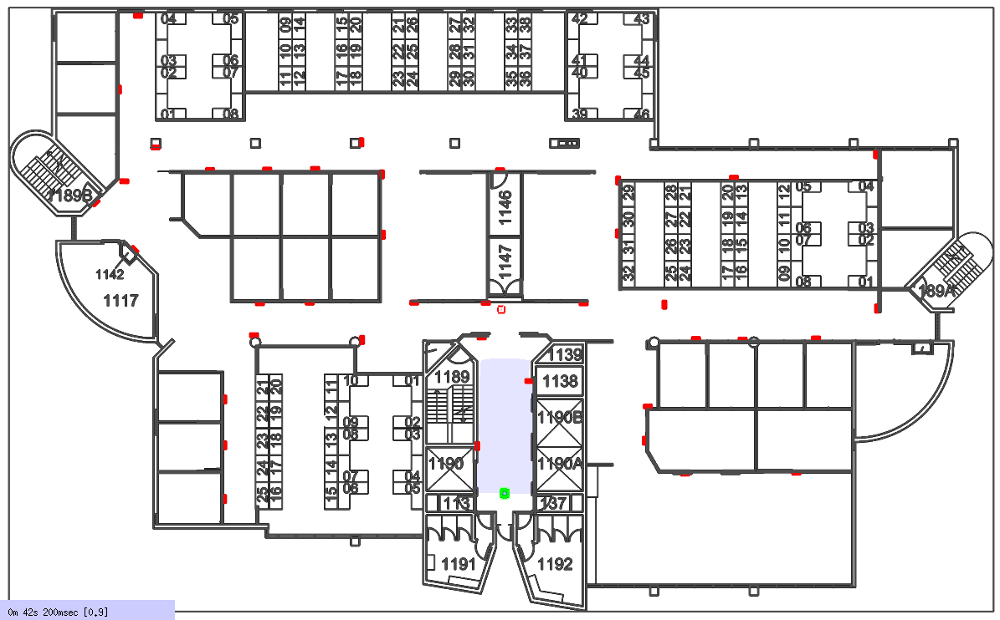

<p align=center><strong>~ Please see the <a href="https://btalb.github.io/abstract_map/">abstract map site</a> for further details about the research publication ~</strong></p>

# Using the Abstract Map in a 2D Stage simulation



Package contains everything needed to simulate the zoo experiments performed in our [IEEE TCDS journal](https://doi.org/10.1109/TCDS.2020.2993855). The package includes: 
- world & launch files for a stage simulation of the GP-S11 environment on QUT's Gardens Point campus
- a tool for creating simulated tags in an environment & saving them to file,
- launch & config files for using the move_base navigation stack with gmapping to explore unseen simulated environments

## Installing the abstract map simulator

*Note: this is just the simulator; to use the abstract map with the simulator please make sure you use the [abstract_map](https://github.com/btalb/abstract_map) package*

Clone the repo:
```
git clone https://github.com/btalb/abstract_map_simulator
```

Add the new package to your ROS workspace at `<ROS_WS>/` by linking in the cloned repository:
```
ln -s <LOCATION_REPO_WAS_CLONED_ABOVE> <ROS_WS>/src/
```

Install all of the listed ROS dependencies, and build the package:
```
cd <ROS_WS>/src/
rosdep install abstract_map_simulator
cd <ROS_WS>
catkin_make
```

## Acknowledgements & Citing our work

This work was supported by the Australian Research Council's Discovery Projects Funding Scheme under Project DP140103216. The authors are with the [QUT Centre for Robotics](https://research.qut.edu.au/qcr/).

If you use this software in your research, or for comparisons, please kindly cite our work:

```
@ARTICLE{9091567,  
    author={B. {Talbot} and F. {Dayoub} and P. {Corke} and G. {Wyeth}},  
    journal={IEEE Transactions on Cognitive and Developmental Systems},   
    title={Robot Navigation in Unseen Spaces using an Abstract Map},   
    year={2020},  
    volume={},  
    number={},  
    pages={1-1},
    keywords={Navigation;Robot sensing systems;Measurement;Linguistics;Visualization;symbol grounding;symbolic spatial information;abstract map;navigation;cognitive robotics;intelligent robots.},
    doi={10.1109/TCDS.2020.2993855},
    ISSN={2379-8939},
    month={},}
}
```
